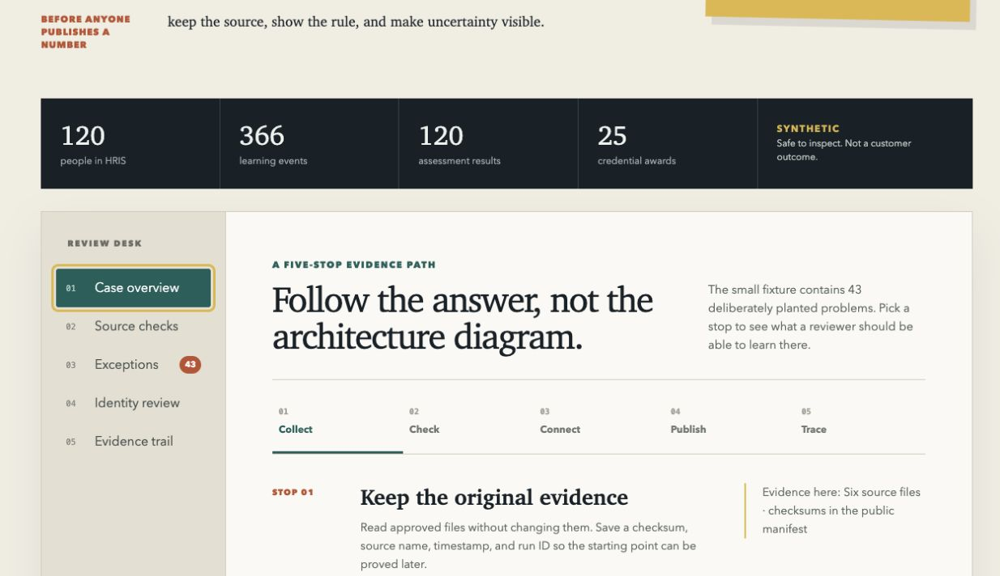

# EduWork DataBridge, explained simply

Every example in this guide comes from the public synthetic case file, so you can check any claim against the repository itself.

## The question that starts everything

Somebody asks: who completed the cybersecurity training, passed the assessment, and received the certificate?

That sounds like a five-minute question. It rarely is. The employee list lives in HR. Completions live in the learning platform, under its own user IDs. Scores arrive in a spreadsheet. Certificates sit in a fourth system with its own idea of everyone's name. So someone exports four files, spends an afternoon on VLOOKUPs, and produces a report that looks tidy. Six weeks later, nobody can explain every choice that went into it.

EduWork DataBridge is an open-source reference implementation for doing that reconciliation with receipts. It does not replace HR, the LMS, or anything else. It sits beside them, brings their records into one checked structure, and keeps the evidence for every step.

## The five-year-old version

Your toys are all over the house. Cars under the bed, blocks in the kitchen, a few sets missing pieces, and one box labeled "dinosaurs" that contains no dinosaurs at all.

Now someone asks you to put every toy in one place, set the broken ones aside instead of hiding them, fix the wrong labels, and write down where each toy came from so nobody argues about it later.

That is the whole idea. DataBridge does this for training and workforce records instead of toys. The part most tools skip is the last one: it never throws a broken toy in the trash just to make the shelf look tidy, and it always remembers which room everything came from.

## Meet Elena, who exists twice

The demo ships with a fictional company of 120 people. One of them is Elena Ibrahim, employee EMP-0000005 in the HR file. The learning platform knows her twice, once as LMS-0000005 and again as LMS-DUP-0000005, the kind of duplicate that appears when an account gets recreated and the old one never dies.

A spreadsheet join either counts Elena's training twice or misses half of it, depending on which account it finds first. DataBridge is built to notice her. Her two accounts agree on the employee reference, the name, and the department, so the system proposes a link and shows the evidence behind it. Had her records disagreed on a trusted identifier, the merge would have been blocked and a reviewer would see exactly why.

Elena is one of six duplicate accounts planted in the demo data. Nothing about her is real except the pattern, and every training manager has met the pattern.

## What happens to a file, step by step

When a source file enters the pipeline, this happens in order:

1. The original bytes are stored unchanged, with a checksum. Cleanup never touches the evidence.
2. The file is profiled: columns, types, missing values, duplicates, and drift since the last delivery.
3. Fields are mapped into one shared model, with plain names like Person, Participation, AssessmentResult, and CredentialAward.
4. Validation rules run. They cover structure, completeness, allowed values, uniqueness, relationships, dates that make sense, agreement between sources, and arrival time.
5. Records that fail are quarantined with a reason code. Nothing is silently deleted or silently fixed.
6. Identity matching runs, trusted identifiers first. Conflicting IDs block a merge. Uncertain cases wait for a human.
7. Whatever gets published, whether a mart, a CSV or Parquet export, or an API response, carries a data dictionary, permissions, masking, and a lineage trail that leads back to step 1.

Sources can be CSV, Excel, JSON, or Parquet files, plus PostgreSQL databases and REST endpoints. The same path applies to all of them.

## A case file with planted problems

The demo data is broken on purpose. The small case file contains 120 fictional people, 6 courses, 366 learning events, 120 assessment results, and 25 credential awards. Hidden inside are 43 planted problems across nine types, and the answer key ships with the data.

A few of them, in plain English:

- Nine people whose employee ID is blank in HR while other systems still remember it.
- Seven completion statuses that are not on the list of allowed statuses.
- Five courses completed before they were assigned, which is time travel.
- Six people with two learning accounts. Elena is one of them.
- One credential awarded before the assessment that justifies it.
- One text value that begins like a spreadsheet formula, which is how injection problems sneak into exports.

Run the demo and the system should catch every one. That is the point of the fixture: you can watch the pipeline work on problems you can verify by hand, because the problems were planted deterministically and documented.

## The reviewer desk

The frontend is a review console rather than a dashboard. It walks a five-stop evidence path: collect, check, connect, publish, trace. You can see the source inventory, filter the planted exceptions by type, preview an identity decision for a duplicate like Elena, and follow one published field back to the raw snapshot it came from.



One honest wrinkle: review decisions made in the demo console are deliberately not saved. The backend services remain the authoritative path for recorded decisions, and the console says so plainly.

## Why teams bother

Most organizations already own every record they need. The trouble is that the records disagree, the IDs do not line up, and the person who reconciled them last quarter did it by hand and remembers roughly half of the decisions. Each new source, department, or customer starts the whole exercise over.

DataBridge turns that recurring chore into configuration. Connectors, mappings, and validation rules are reusable, so the second report costs less than the first. Errors become named, reviewable exceptions instead of quiet edits. And when a manager asks where a number came from, the answer is a lineage trail, not an excavation.

## How to try it

The quickest look uses Docker:

```
git clone https://github.com/imtiazither/eduwork-databridge.git
cd eduwork-databridge
cp .env.example .env
docker compose up --build
```

The API comes up at http://localhost:8000 and the reviewer desk at http://localhost:5173. The demo configuration contains no real people or company data.

For development, the Makefile covers the same ground:

```
make install
make generate
make phase8-demo
make api          # one terminal
make ui           # another terminal
```

`make check` runs linting, type checks, backend tests, and frontend tests. `make generate` rebuilds the synthetic case file deterministically from a fixed seed.

## How to talk about it honestly

The project is a pre-production reference implementation. That is a real thing worth showing, and it is not the same as a proven product. The wording matters.

| Do not say | Say instead |
| --- | --- |
| Companies already use it. | It is a reference implementation ready for a bounded pilot. |
| It guarantees savings. | A pilot can measure preparation time, exception rates, and reviewer burden. |
| It is certified compliant. | It includes audit, masking, retention, and access controls that still need deployment-specific review. |
| It replaces the HRIS or LMS. | It connects and governs data from the systems already in place. |

## The story behind it, and what it contributes

The project began with watching how the Monday-morning question actually gets answered. Four exports. A missing employee ID filled in from memory. Two similar accounts merged on a hunch. A completion date that predates the assignment, left alone because the report is due at noon. The answer arrives on time, and the reasoning evaporates.

DataBridge treats that pipeline as a chain of evidence. Its contribution is a working demonstration of four commitments that usually stay theoretical.

Evidence comes before cleanup. Raw snapshots are immutable and checksummed, so the starting point survives every later transformation.

Bad records get a path, not a deletion. A validation failure carries a reason code, a severity, and a review history, which makes a later correction or waiver inspectable.

Identity is conservative. Trusted, organization-scoped identifiers come first, conflicts block a match, and the gray zone belongs to a human reviewer whose decision is recorded and reversible.

Governance travels with the output. A published mart or export carries its checksum, dictionary, lineage, permission boundary, and retention metadata, so the report is never separated from the evidence needed to understand it.

There is also a line the project will not cross. It prepares evidence; it does not decide employment, eligibility, admission, or access to services, and it does not turn a probability into a fact. In workforce and education data, restraint is a feature. The longer version of this story lives in PROJECT_STORY.md.

## Where to go next

- The five-page field guide, EduWork_DataBridge_Field_Guide.pdf, for a shorter printable summary.
- PROJECT_OVERVIEW.md for the complete usage guide.
- PROJECT_STORY.md for the full story and contribution.
- ARCHITECTURE.md and the docs site for the technical design.

This guide describes the public repository as of July 2026. Everything in it can be checked against the code and the synthetic case file. No real people appear anywhere, and nothing here claims a customer deployment or a production result.
