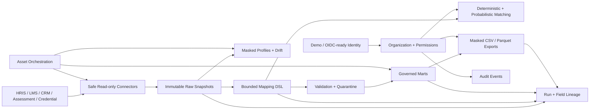
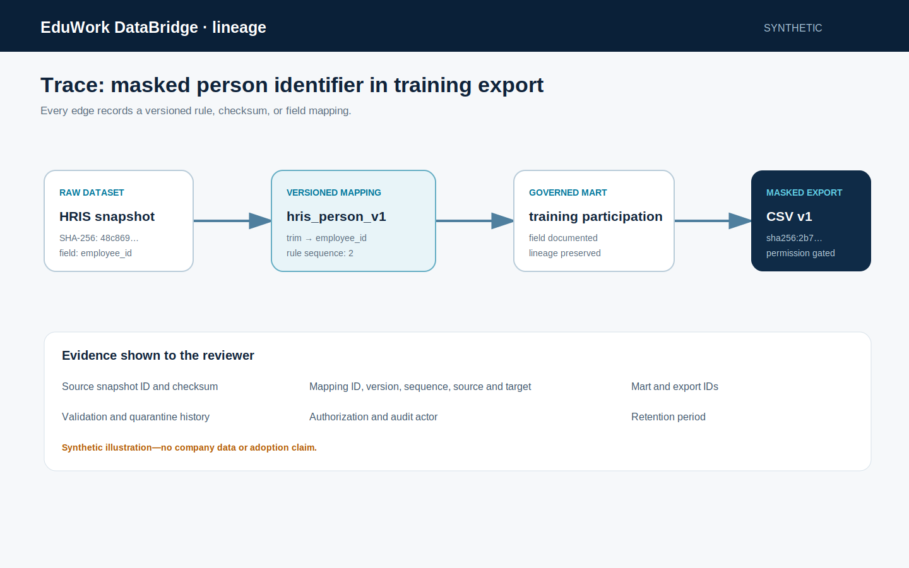

# Architecture

EduWork DataBridge is a modular monolith with explicit package contracts and a local-first container topology.

## Data zones

- Bronze: immutable raw snapshots and manifests
- Silver preparation: mapped, validated, quarantined, and identity-linked evidence
- Gold: documented marts and permission-gated exports
- Control plane: source, contract, run, rule, review, lineage, model, export, orchestration, retention, audit, and access metadata
