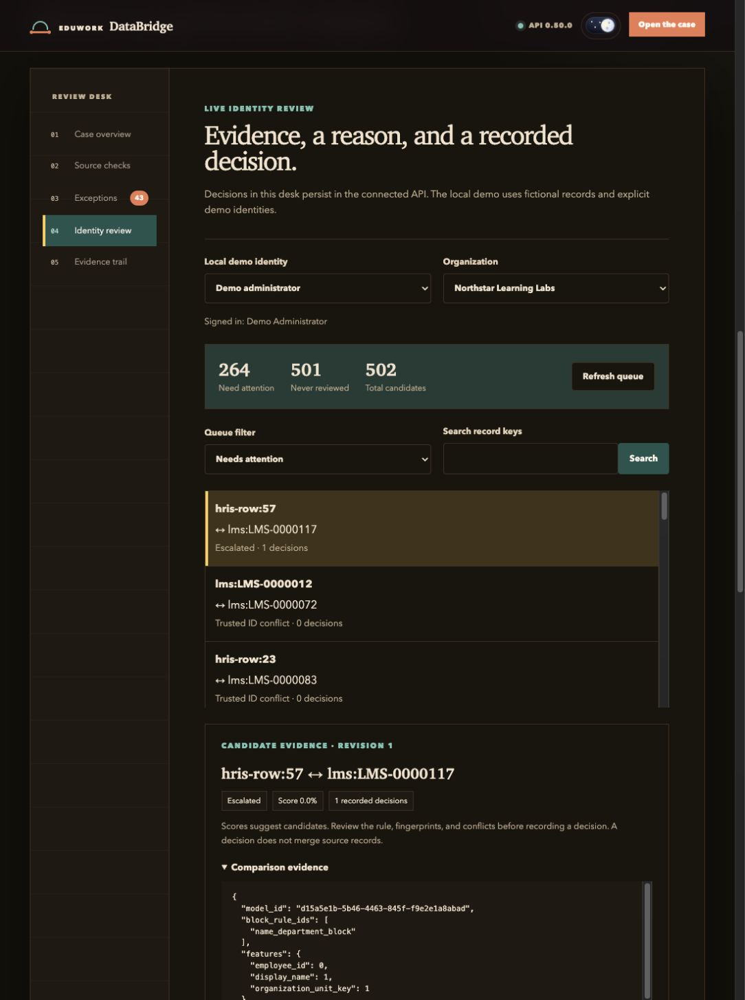

# Connected Review Workbench

The local identity desk reads candidates from the API and saves reasoned decisions to the control database. Run `make demo`, start `make api` and `make ui` in separate terminals, and open **Identity review**. An empty queue offers **Generate synthetic candidates**, which creates one small probabilistic run in the selected organization. Repeated runs append candidates; they do not erase earlier review history.

## Review a candidate

1. Select an explicit local demo identity and an accessible organization.
2. Start with **Needs attention**, which includes pending, review, trusted-ID conflict, deferred, and escalated candidates. **Never reviewed** also includes automatic suggestions with no human decision.
3. Search either record key, filter by current status, or page through the queue.
4. Inspect rule, score, masked comparison evidence, and prior decisions. A score is a suggestion; a trusted-ID conflict needs source-owner evidence.
5. Choose match, keep separate, defer, or escalate. Enter a reason and save.
6. Refresh to confirm persistence. A later decision supersedes the previous one while retaining its reason and reviewer in history.

The API requires `matching:write` for queue, summary, history, and decision requests. The local demo viewer can read source metadata but cannot use identity-review controls. The UI separates query caches by identity and organization.

## Concurrent review

Each candidate has a `revision`, starting at zero. A decision request must carry that value as `expected_revision`. The database compares and advances it atomically. A successful decision returns the next revision and commits with its audit event. Two reviewers submitting the same revision cannot both save.

An HTTP 409 means the candidate changed. The desk requires a refresh before another save; inspect the latest decision and enter a reason for the next revision. Errors never become simulated successful decisions. History is ordered by revision and paged with bounded `limit` and `offset` values.

## Public preview

The GitHub Pages build makes no API requests. Its identity interaction is labeled as a static preview and resets on refresh. An offline local case file uses the same preview. Source checks, exception examples, and the illustrated evidence trail describe the committed synthetic fixture; only the connected identity desk provides persisted review controls in this release.

## Decision boundary

Saving a decision records review evidence and candidate status. It does not merge source records, rewrite person clusters, or change already published marts and exports. Probabilistic matching vetoes conflicting trusted IDs across entire clusters, including a bridge record whose own ID is missing. Production matching thresholds, reviewer roles, identity infrastructure, and deployment checks still require separate validation.
