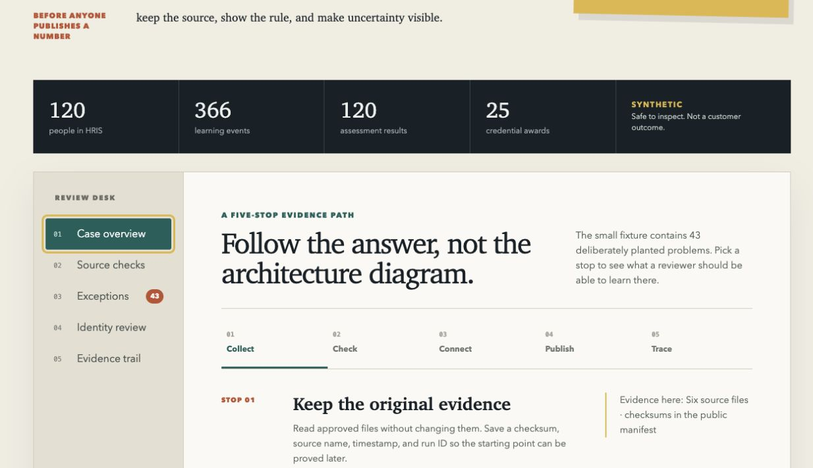

# EduWork DataBridge

**Current release: v0.20.0**

EduWork DataBridge turns fragmented learning, training, skills, credential, HRIS, LMS, CRM, assessment, and workforce records into documented, validated, reviewable, and traceable data products.

It began with a smaller problem: a training report assembled from four systems should not become impossible to explain after the spreadsheet is emailed. Read [the story behind the project](PROJECT_STORY.md) or download the [five-page field guide](EduWork_DataBridge_Field_Guide.pdf).

## What this release demonstrates

- Safe read-only ingestion from CSV, XLSX, JSON, Parquet, REST, and PostgreSQL
- Immutable raw snapshots, checksums, cursors, retries, and resume evidence
- Masked profiling and configurable drift comparison
- Bounded mapping DSL and governed lookup tables
- Eight validation categories and immutable quarantine history
- Deterministic and probabilistic identity-linkage evidence with human review
- Reasoned, reversible match decisions with protected API and audit evidence
- A protected, filterable match-review queue with workload summary
- Run and field lineage plus OpenLineage-compatible events
- Governed marts and masked CSV/Parquet exports
- Asset orchestration, partitions, retries, watermarks, backfills, and telemetry
- Demo/OIDC-ready identity contracts, authorization, audit, and retention
- Reproducible tests, benchmark evidence, SBOMs, packaging, and release controls

<video controls width="100%" preload="metadata">
  <source src="assets/eduwork-databridge-walkthrough.mp4" type="video/mp4">
  Your browser does not support the walkthrough video.
</video>

!!! note "Evidence boundary"
    Public examples use synthetic data and do not claim customer adoption, regulatory certification, or measured business outcomes.

## Start based on your goal

- **Evaluator:** follow the [30-minute tour](evaluator/30-minute-tour.md).
- **Developer:** use the [developer setup](developer/getting-started.md).
- **Security reviewer:** read the [connector threat model](security/connector-threat-model.md) and [release checklists](release/release-checklist.md).
- **Potential collaborator:** begin with one bounded, authorized parallel workflow and preserve factual evidence.
